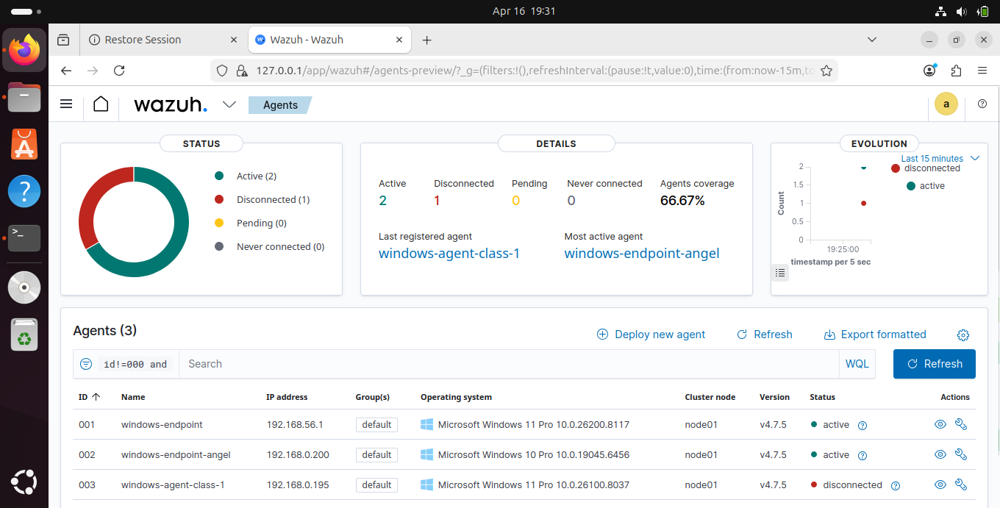
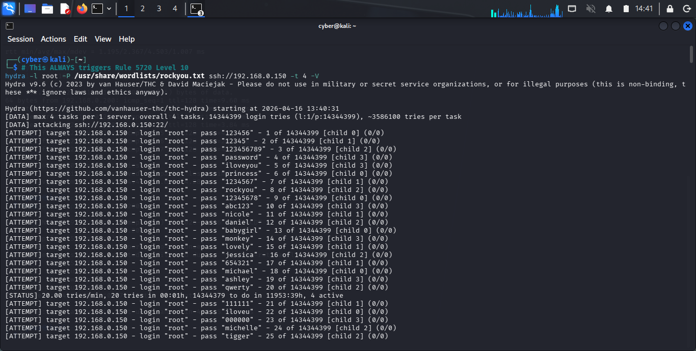
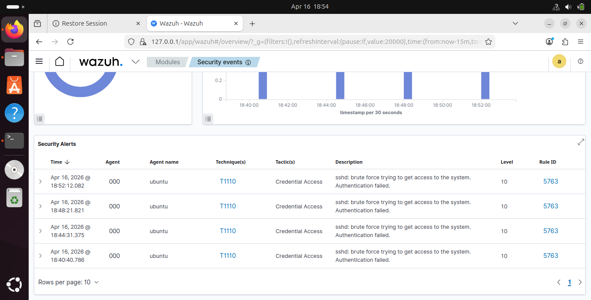
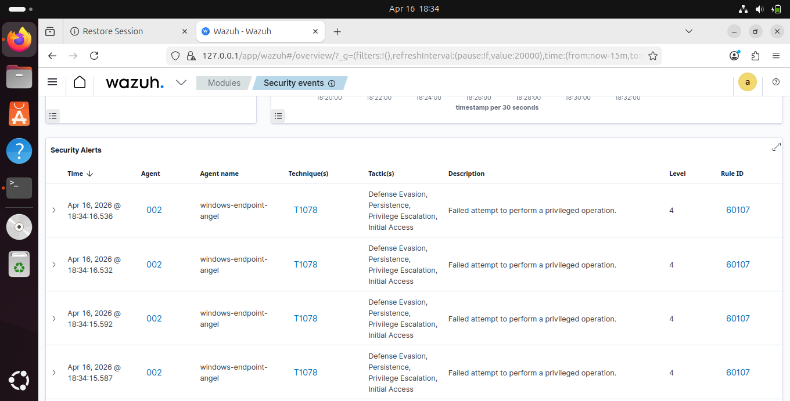
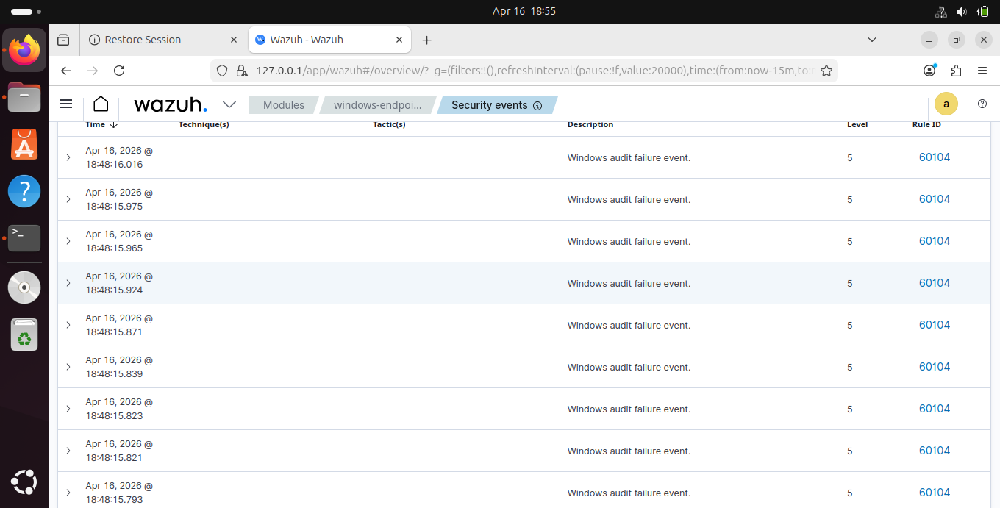
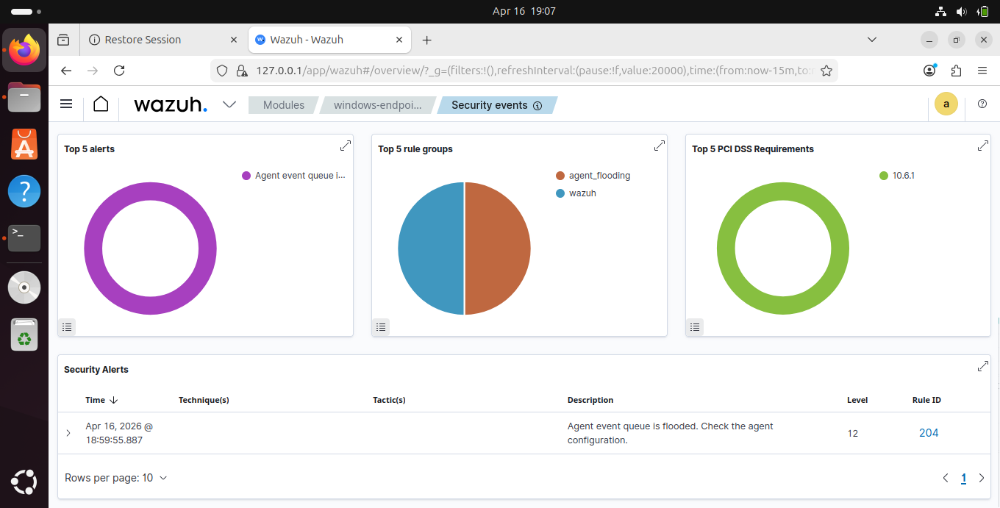
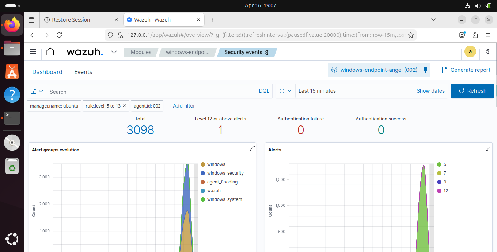
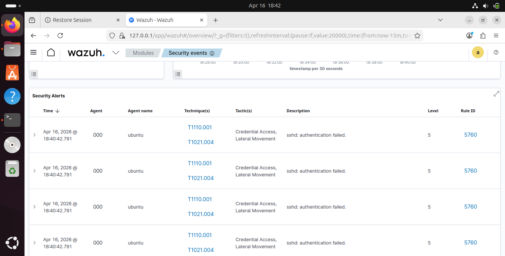
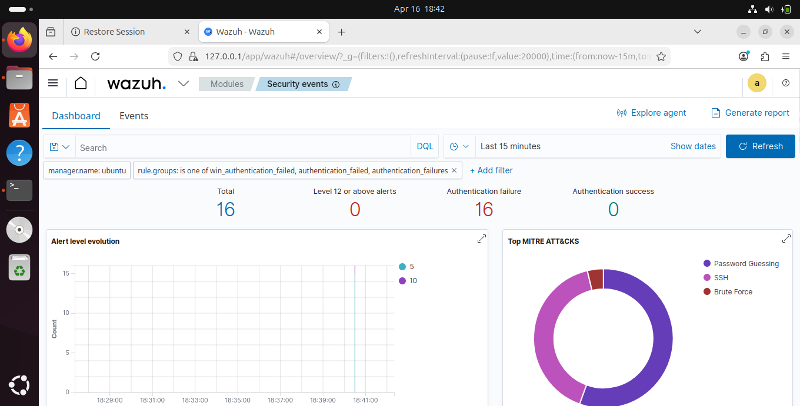

# Enterprise Security Monitoring Lab — Wazuh SIEM/XDR


---

## Objective

This project is Phase 2 of a two-part security monitoring lab series. Having built a foundational understanding of Host-based Intrusion Detection using OSSEC in Phase 1, this phase upgrades the entire environment to Wazuh 4.7.5 the modern enterprise-grade evolution of OSSEC — adding a full SIEM dashboard, MITRE ATT&CK mapping, multi-agent management across independent network segments, and real-time threat visualization.

The lab simulates a real **Security Operations Center (SOC)** environment where a central Wazuh server monitors multiple independent Windows endpoints across different networks, detects live attacks from a dedicated Kali Linux attacker machine, and automatically maps every detection to the MITRE ATT&CK framework.

Key areas covered:

- SSH brute-force detection with automatic MITRE ATT&CK technique mapping
- Windows endpoint monitoring across independent machines on different networks
- Multi-agent centralized management from a single Wazuh dashboard
- Real-time alert visualization with severity escalation up to Level 12 Critical
- Compliance framework monitoring — PCI-DSS triggered automatically


## Lab Architecture

```
┌──────────────────────────────────────────────────────────────────────┐
│                         NETWORK OVERVIEW                              │
│                                                                        │
│   ┌─────────────────┐                                                  │
│   │   KALI LINUX    │──── attacks ──────────────────────────────┐     │
│   │   (Attacker)    │                                            │     │
│   └─────────────────┘──── attacks ──────────────┐               │     │
│                                                  │               │     │
│   ┌─────────────────┐    ┌─────────────────────────────────────────┐  │
│   │ WINDOWS AGENT 1 │───▶│           UBUNTU 24.04 LTS              │  │
│   │  Host-Only Net  │    │         (Wazuh Server — Brain)          │  │
│   └─────────────────┘    │  192.168.56.101 / 192.168.0.150         │  │
│                           │  Wazuh Manager + Indexer + Dashboard   │  │
│                           └──────────────────┬──────────────────────┘  │
│                                              │                          │
│   ┌─────────────────┐                        │    ┌──────────────────┐  │
│   │ WINDOWS AGENT 2 │────────────────────────┘    │ WINDOWS AGENT 3  │  │
│   │   WiFi Network  │                             │ External Laptop  │  │
│   └─────────────────┘                             └──────────────────┘  │
└──────────────────────────────────────────────────────────────────────────┘
```

The Wazuh server runs **two active network interfaces** simultaneously one on the VirtualBox Host-Only network and one bridged to the real WiFi network — receiving agent logs from machines on completely different network segments through a single dashboard.

**Agents 2 and 3 are both fully independent external machines** not part of the VirtualBox environment, connected to the Wazuh server purely over shared WiFi. This demonstrates real-world distributed endpoint monitoring across independently managed machines on a live network.


## Installation & Setup


### Step 1 — Add Swap File
```bash
sudo fallocate -l 2G /swapfile
sudo chmod 600 /swapfile
sudo mkswap /swapfile
sudo swapon /swapfile
echo '/swapfile none swap sw 0 0' | sudo tee -a /etc/fstab
```

### Step 2 — Stop OSSEC
```bash
sudo /var/ossec/bin/ossec-control stop
sudo systemctl disable apache2
```

### Step 3 — Download and Run Wazuh Installer
```bash
cd /tmp
curl -sO https://packages.wazuh.com/4.7/wazuh-install.sh
curl -sO https://packages.wazuh.com/4.7/config.yml
sudo bash /tmp/wazuh-install.sh -a -i
```

Installation takes 15-20 minutes. At completion the terminal outputs the admin password — save it immediately.

### Step 4 — Reduce Indexer Memory (4GB RAM systems)
```bash
sudo nano /etc/wazuh-indexer/jvm.options
# Change -Xms1g / -Xmx1g to -Xms512m / -Xmx512m
sudo systemctl restart wazuh-indexer
```

### Step 5 — Open Firewall Ports
```bash
sudo ufw allow 443/tcp
sudo ufw allow 1514/tcp
sudo ufw allow 1514/udp
sudo ufw allow 1515/tcp
sudo ufw reload
```

### Step 6 — Make Bridged Network IP Persistent
```bash
sudo nano /etc/netplan/01-network-manager-all.yaml
```
```yaml
network:
  version: 2
  ethernets:
    enp0s9:
      dhcp4: no
      addresses:
        - 192.168.0.150/24
      routes:
        - to: default
          via: 192.168.0.1
      nameservers:
        addresses: [8.8.8.8, 8.8.4.4]
```
```bash
sudo netplan apply
```

### Step 7 — Add Windows Agents
On the **Wazuh Dashboard** click **Agents** → **Deploy new agent** → select Windows → set Manager IP → copy the generated PowerShell command.

On each **Windows machine — PowerShell as Administrator:**
```powershell
# Paste the generated command, then start the agent:
NET START WazuhSvc
```

### Step 8 — Verify All Agents Connected
```bash
sudo /var/ossec/bin/agent_control -l
```

---

## Lab Setup

### All 3 Agents Active on Wazuh Dashboard

> Wazuh simultaneously managing 3 independent Windows endpoints across two network segments — including two fully independent external machines connected purely over shared WiFi

---

## 🔴 Demo 1 — SSH Brute Force Detection

**From Kali — 14 million password attempts against Ubuntu:**
```bash
hydra -l root -P /usr/share/wordlists/rockyou.txt ssh://192.168.0.150 -t 4 -V
```


> Hydra hammering 192.168.0.150 with the full rockyou wordlist — 14,344,399 attempts across 4 parallel threads

**Alerts generated:**
```
Rule 5760  (Level 5)  → sshd: authentication failed
Rule 5763  (Level 10) → sshd: brute force trying to get access to the system
```


> Rule 5763 Level 10 — Wazuh correlating authentication failures into a confirmed brute force pattern. MITRE T1110 Credential Access and T1021.004 Lateral Movement mapped automatically.

---

## 🔴 Demo 2 — Windows Endpoint Attack

**SMB and RDP brute force against external Windows machine:**
```bash
hydra -l administrator -P /usr/share/wordlists/rockyou.txt smb://192.168.0.200 -t 4 -V
hydra -l administrator -P /usr/share/wordlists/rockyou.txt rdp://192.168.0.200 -t 4 -V
```


> MITRE T1078 (Valid Accounts) automatically mapped across four tactics simultaneously — Defense Evasion, Persistence, Privilege Escalation, and Initial Access


> Rule 60104 — Windows audit failure events flooding in from the remote agent and forwarded to the Wazuh server in real time

---

## 🔴 Demo 3 — Level 12 Critical Alert

The combined volume of simultaneous attacks across multiple agents overwhelmed the Wazuh event queue — generating a **Level 12 Critical alert**. This mirrors a real SOC scenario where attackers deliberately flood logging systems to exhaust resources.


> Rule 204 Level 12 — Agent event queue flooded. PCI-DSS requirement 10.6.1 triggered automatically.


> 3,098 total alerts from a single agent in one session — attack spike visible on the alert evolution chart

---

## 🔴 Demo 4 — MITRE ATT&CK Automatic Mapping

Every attack was automatically classified into the MITRE ATT&CK framework — no manual tagging required.


> MITRE technique and tactic columns automatically populated on every alert


> Password Guessing, SSH, and Brute Force techniques detected and categorized across all agents

| Technique | ID | Tactic |
|---|---|---|
| Brute Force | T1110 | Credential Access |
| Password Guessing | T1110.001 | Credential Access |
| Remote Services SSH | T1021.004 | Lateral Movement |
| Valid Accounts | T1078 | Defense Evasion, Persistence, Privilege Escalation, Initial Access |

---

## Alert Summary

| Rule | Level | Description | Source |
|---|---|---|---|
| 5760 | 5 | sshd: authentication failed | auth.log |
| 5763 | 10 | 🔴 sshd: brute force detected | auth.log |
| 60104 | 5 | Windows audit failure event | WinEvtLog |
| 60107 | 4 | Failed privileged operation attempt | WinEvtLog |
| **204** | **12** | **🔴 Agent event queue flooded** | **Wazuh** |

**Total alerts — single session: 3,098 | Highest level: 12 Critical | PCI-DSS: 10.6.1**

---

## Key Takeaways

**Wazuh as a SOC Platform**
A single Wazuh server replicated core enterprise SOC capability — centralized multi-agent detection, automatic MITRE ATT&CK classification, and compliance monitoring all running on a 4GB RAM virtual machine.

**Multi-Network Distributed Monitoring**
Agents across two network segments — VirtualBox Host-Only and real WiFi — all reporting to one server. This reflects how enterprise environments actually work across subnets and physical locations.

**Independent External Agents**
Agents 2 and 3 were completely independent machines connected only over shared WiFi — no VPN, no domain membership, no special setup beyond the agent install. Wazuh scales to any machine that can reach the manager IP regardless of who owns or manages it.

**MITRE ATT&CK Without Manual Work**
Every detection automatically classified into techniques and tactics. Alerts are immediately actionable and communicable using the global standard framework SOC analysts use daily.

**Alert Escalation Chain**
Single failed login → Level 5. Sustained brute force → Level 10. Combined multi-agent attack flood → Level 12 Critical. Raw log volume transformed into prioritized threat intelligence automatically.

---

## Repository Structure

```
Wazuh-Enterprise-Security-Lab/
├── README.md
├── screenshots/
│   ├── wazuh-agents-dashboard.png
│   ├── hydra-ssh-bruteforce.png
│   ├── wazuh-ssh-bruteforce-level10.png
│   ├── wazuh-mitre-attack-map.png
│   ├── wazuh-mitre-donut-chart.png
│   ├── wazuh-windows-endpoint-alerts.png
│   ├── wazuh-windows-audit-failure.png
│   ├── wazuh-level12-queue-flooded.png
│   └── wazuh-3098-alerts-dashboard.png
└── configs/
    └── ossec.conf
```

## Author

**Emmanuel Siamoonga**
Cloud Infrastructure | Network and Cloud Security

[](https://www.linkedin.com/in/emmanuel-siamoonga-98b30929b/)
[](https://github.com/Emmanuel-cpp)

> *"Security is not a product, but a process."* — Bruce Schneier
